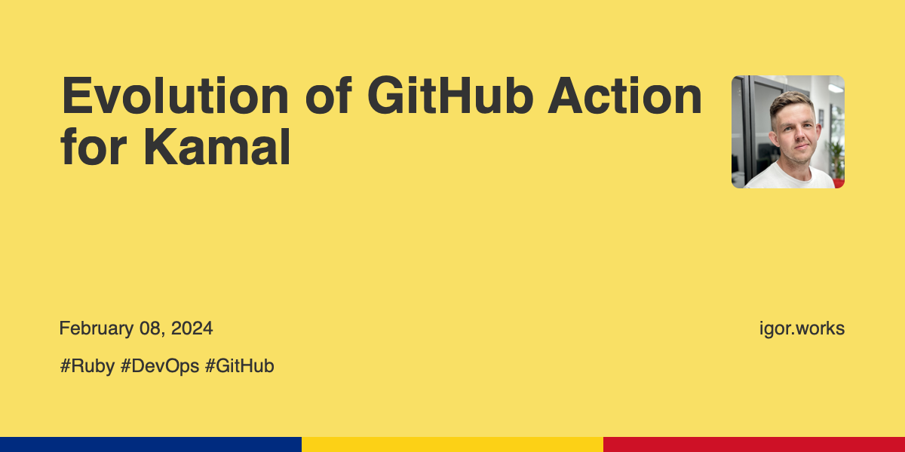

# Jekyll OG Image

A Jekyll plugin to automatically generate open graph images for posts.

[](https://badge.fury.io/rb/jekyll-og-image)
[](https://github.com/igor-alexandrov/jekyll-og-image/actions/workflows/lint.yml)
[](https://github.com/igor-alexandrov/jekyll-og-image/actions/workflows/specs.yml)

## Installation

Add this line to your site's Gemfile:

```ruby
  gem 'jekyll-og-image'
```

And then add this line to your site's `_config.yml`:

```yaml
plugins:
  - jekyll-seo-tag
  - jekyll-og-image
```

## Usage

Jekyll OG Image works together with [jekyll-seo-tag](https://github.com/jekyll/jekyll-seo-tag) plugin. It automatically generates open graph images for posts and inserts them into the posts metadata.

## Configuration

The plugin can be configured in the `_config.yml` file or in the post's front matter.

The following configuration options are available:

* `output_dir` – The directory where the generated images will be saved. Default: `assets/images/og`

* `force` – If set to `true`, the plugin will generate an image for every post, even if the post already has an image. Default: `false`

* `verbose`  – If set to `true`, the plugin will output additional information about the image generation process. Default: `false`

* `skip_drafts` – If set to `true`, the plugin will skip post drafts when generating images. Default: `true`

* `canvas` – The canvas configuration options:
  * `background_color` – The background color of the canvas. Default: `#FFFFFF`
  * `background_image` – The background image of the canvas. Default: `nil`

* `header` – The header configuration options:
  * `font_family` – The font family of the header text. Default: `Helvetica, Bold`
  * `color` – The color of the header text. Default: `#2f313d`

* `content` – The content configuration options:
  * `font_family` – The font family of the content text. Default: `Helvetica, Regular`
  * `color` – The color of the content text. Default: `#535358`

* `border_bottom` – The border bottom configuration options:
  * `width` – The width of the border bottom. Default: `20`
  * `fill` – The array of colors to fill the border bottom. Default: `["#000000"]`

* `domain` – The domain name to use in the image. Default: `nil`

* `image` – Path to the image to use as the logo. Default: `nil`

## Examples

Configuration can be defined on the site level or on the post level.

For a side wide level configuration, edit your `_config.yml`, for a post level configuration, edit the post's front matter.

### Single Color

```yaml
# _config.yml
og_image:
  output_dir: "assets/images/og"
  domain: "igor.works"
  border_bottom:
    width: 20
    fill:
      - "#4285F4"
```


### Multiple Colors

```yaml
# _config.yml
og_image:
  output_dir: "assets/images/og"
  image: "/assets/images/igor.jpeg"
  domain: "igor.works"
  border_bottom:
    width: 20
    fill:
      - "#820C02"
      - "#A91401"
      - "#D51F06"
      - "#DE3F24"
      - "#EDA895"
```


### Background Color and Text Color

```yaml
# _config.yml
og_image:
  output_dir: "/assets/og"
  image: "/assets/images/igor.jpeg"
  canvas:
    background_color: "#F9E065"
  header:
    font_family: "Roboto, Bold"
    color: "#333333"
  content:
    font_family: "Roboto, Regular"
    color: "#333333"
  force: false
  domain: "igor.works"
  border_bottom:
    width: 50
    fill:
      - "#002B7F"
      - "#FCD116"
      - "#CE1126"
```



### Background Image

```yaml
# _config.yml
og_image:
  output_dir: "/assets/og"
  image: "/assets/images/igor.jpeg"
  header:
    font_family: "Roboto, Bold"
    color: "#333333"
  content:
    font_family: "Roboto, Bold"
    color: "#333333"
  force: false
  domain: "igor.works"

# _posts/2024-02-15-traefik-tunning-for-rails-applications-part-1.md
---
title: Traefik Tuning for Rails Applications (part 1)
layout: post
tags:
  - Rails
  - Traefik
  - Kamal
og_image:
  canvas:
    background_image: "/assets/images/bc_3.jpg"
```


## Contributing

* Fork it (https://github.com/igor-alexandrov/jekyll-og-image)
* Create your feature branch (`git checkout -b my-new-feature`)
* Commit your changes (`git commit -am 'Add some feature'`)
* Push to the branch (`git push origin my-new-feature`)
* Create a new Pull Request

## License

The gem is available as open source under the terms of the [MIT License](https://opensource.org/licenses/MIT).
